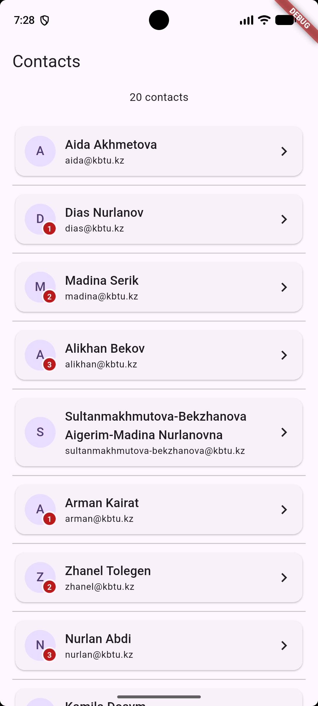
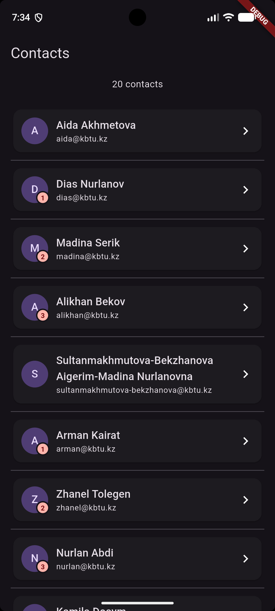
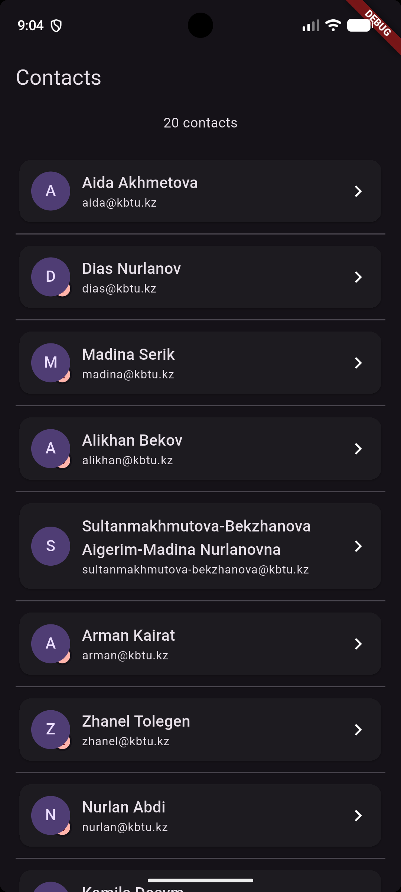

# Practice 5: A Screen That Never Overflows

A Flutter application developed as part of mobile development coursework at KBTU. This project focuses on managing layout constraints, avoiding UI overflow errors (`Unbounded height` / `Overflow`), implementing theme switching, and understanding component layer ordering.

---

## 📱 Screenshots

### 1. Light and Dark Theme Support
The application automatically adapts to system theme settings using Material Design roles (`ColorScheme.fromSeed`, `colorScheme.error`, and `colorScheme.onError`).

| Light Theme | Dark Theme |
| :---: | :---: |
|  |  |

---

### 2. Stack Layer Ordering (`stack_swapped.png`)
Demonstrates how child order inside a `Stack` affects rendering depth. In the swapped version, the `Positioned` badge is rendered prior to the `CircleAvatar`, placing it beneath the avatar layer.

| Default Stack (Badge on Top) | Swapped Stack (Badge Behind Avatar) |
| :---: | :---: |
|  |  |

---

## 🛠 Key Architecture Concepts

* **`Expanded` Mechanics:** Used horizontally in `Row` to contain flexible text (`Column`) and vertically in `Column` to bound `ListView.separated` within available viewport constraints.
* **`ListView.separated`:** Provides memory-efficient lazy rendering for item lists along with automated `Divider` insertion between items.
* **Data Model (`Contact`):** Features a dynamic getter (`initial`) for avatar text fallback and leverages Dart's `Collection for` loop to dynamically construct 20 contact items.
* **Material Design Color System:** Utilizes `ThemeData` to dynamically derive background and text contrast colors (`error` and `onError`) across light and dark modes.