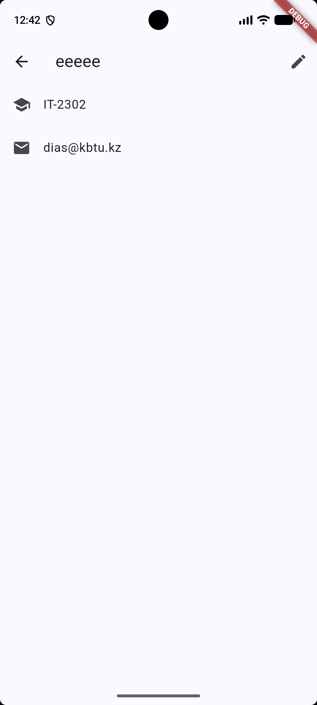
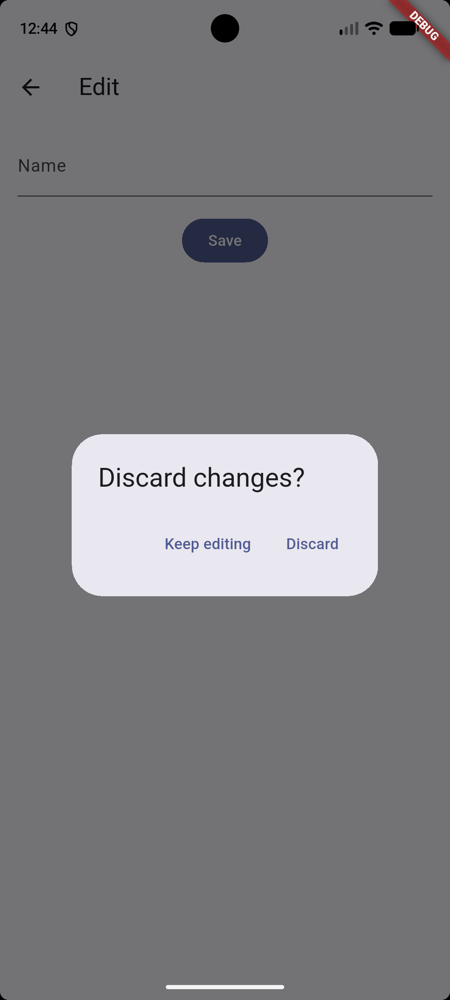

# Practice 6: Screens That Lead to Screens

Flutter app with three screens connected by `Navigator`: a list of students, a detail screen, and an edit form that returns a new name.

## Screens

| Screen | File | Description |
|---|---|---|
| Students | `lib/students_screen.dart` | List of 8 students (`ListView.builder`, `ListTile`). Tap opens the detail screen. |
| Detail | `lib/detail_screen.dart` | Shows name, group and email. The Edit button opens the form and waits for the new name. |
| Edit | `lib/edit_screen.dart` | `TextField` and Save button. Returns the new name with `pop(_name)`. |

## Screenshots

### Detail screen with an edited name

After pressing Edit, typing a new name and pressing Save, the detail screen shows the new name in the app bar.

### Discard changes dialog

If the form has unsaved changes and the user presses back, `PopScope` blocks the pop and shows the dialog. Keep editing stays on the form, Discard leaves without saving.

## Project structure

lib/
main.dart             # MaterialApp, routes, onGenerateRoute
routes.dart           # Route name constants
students.dart         # Student model and data
students_screen.dart  # List screen
detail_screen.dart    # Detail screen
edit_screen.dart      # Edit form with PopScope

## Implementation notes

- **Level 1-2:** `ListView.builder` with `ListTile`. The back arrow is drawn by `AppBar` itself; no `BackButton` or `leading` is used.
- **Level 3:** `pushNamed<String>` and `await`, then a null and `mounted` check, then `setState`. Backing out of Edit returns `null`, so nothing changes.
- **Level 4:** All route names live in `Routes`. `routes:` holds the list screen, `onGenerateRoute` handles the two screens that take a `Student` argument. Screens do not import each other.
- **Level 5:** `PopScope(canPop: !_dirty, onPopInvokedWithResult: ...)`. A dirty form shows `AlertDialog` through `showDialog<bool>`; a clean form and Save never ask.

## Run

flutter pub get
flutter run
flutter analyze
dart format .